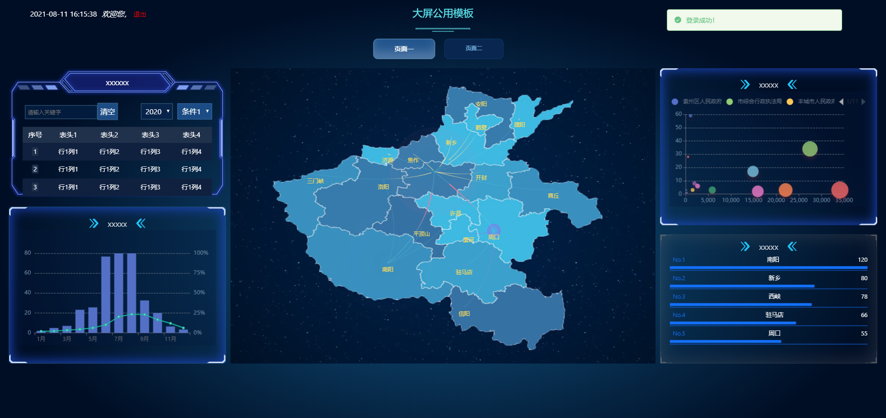
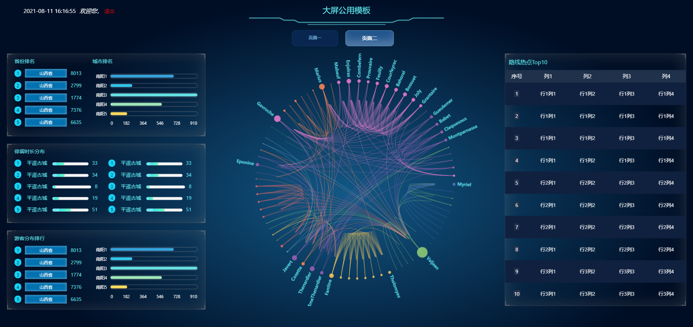

## React + tsx + qiankun + DataV 实现可视化大屏模板


### 在线预览地址：[http://lscreen.liaojs.cn/](http://lscreen.liaojs.cn/)

### 需要掌握知识：
1. React + tsx 全家桶
2. [qiankun](https://qiankun.umijs.org/api)
3. [DataV](http://datav-react.jiaminghi.com/guide/)
4. [plop](https://github.com/plopjs/plop)
5. [scp2](https://www.npmjs.com/package/scp2)
6. Mock.js 模拟后端请求

**生成项目那些就不多说了，直接步入正题！**

### 项目目录
```
├── mock/                          // mock 服务端数据模拟
├── public/                        
└── src/
    ├── .setting/                  // plop 自动生成文件模板配置
    ├── api/                       // 请求接口存放
    ├── common/                    // 公共接口
    ├── components/                // 公共组件目录
    ├── module/                    // 全局基类以及上下文存放位置
    ├── static/                    // 静态资源管理
    ├── store/                     // 状态管理目录
    ├── utils/                     // 工具函数目录
    ├── pages/                     // 页面组件目录
    ├── App.tsx
    ├── index.tsx
    ├── shims-vue.d.ts
├── plopfile.ts                    // 自动生成模板文件
├── upload.server.ts               // 自动上传指定服务器ftp
├── prettier.config.js             // 保存自动格式化
├── tsconfig.json                  // TypeScript 配置文件
├── config-overrides.js            // 项目配置文件
└── package.json

```

### 运行流程

** 主项目跟子项目都必须装包运行起来 **

```

  npm install

  npm start

```


### 界面

1.登录页


2.首页1


2.首页2

